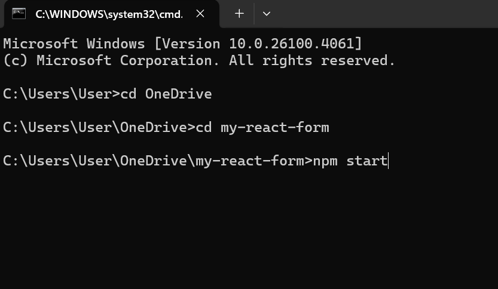
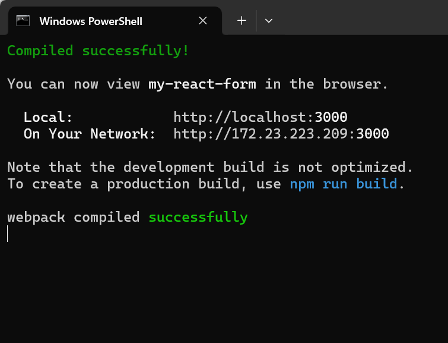
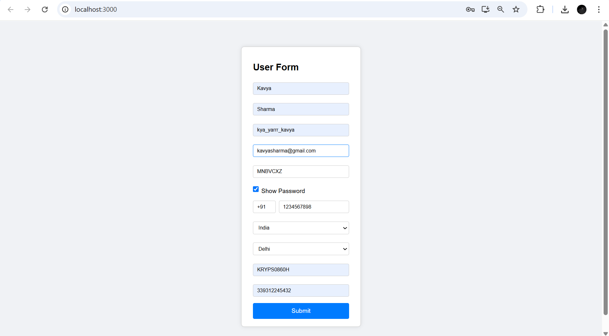
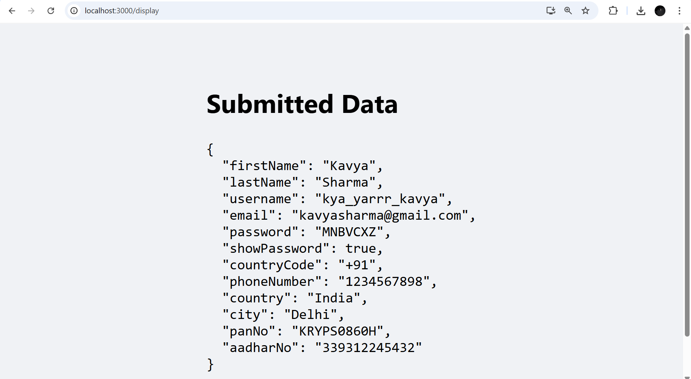

# ✅ Task 1 – React Form with Validation

This task is part of the **Celebal Summer Internship 2025 – React.js Track**. 
The goal of this task is to build a fully functional **form in React** with **input validation**, **conditional submission**, 
and **route-based data display**, without using any third-party libraries for form handling or validation.

---

## 📌 Task Objective

* Create a user registration form with multiple fields
* Apply **custom validation logic** for required fields
* Display **error messages** for invalid or empty inputs
* Disable the **Submit** button until all fields are valid
* On successful submission, navigate to a new route and show the submitted data

---

## 🧹 Features Implemented

✅ Real-time input validation
✅ Error messages for each invalid field
✅ Password show/hide toggle
✅ Phone number with country code format
✅ Country and city dropdowns
✅ Submission disabled until all fields are valid
✅ Data display on a new route after submission using React Router

---

## 🗞️ Form Fields

| Field        | Validation                        |
| ------------ | --------------------------------- |
| First Name   | Required                          |
| Last Name    | Required                          |
| Username     | Required, unique logic (if added) |
| E-mail       | Required, valid format            |
| Password     | Required, minimum length logic    |
| Phone Number | Required, includes country code   |
| Country      | Required (dropdown)               |
| City         | Required (dropdown)               |
| PAN No.      | Required, alphanumeric check      |
| Aadhar No.   | Required, numeric + length check  |

---
##  1. Accessing the `my-react-form` Folder

To work with the React form project, navigate to the `my-react-form` directory inside the repository:


## 2. Start your React application:




## It:

- Compiles your React code using webpack and babel.

- Starts a development server (usually on http://localhost:3000).

- Watches for changes in your code and automatically reloads the browser (hot-reloading).

- Lets you interactively test your UI.
  



### 3. Initial Form Load:

- All input fields are empty.
- The **Submit** button is disabled.
- No error messages are shown initially.

  


### 4. As User Starts Filling the Form:

- Real-time validation occurs as the user types.
- If a field is left empty or filled incorrectly:
  - An **error message** appears below the respective input in **red**.
- For the password field:
  - A toggle button lets the user **show/hide** the password.
- For the phone number:
  - Two inputs: one for the **country code** and one for the **number**.
- When a country is selected:
  - The **city dropdown** updates with the respective cities.

### Once All Fields Are Valid:

- The **Submit** button becomes **enabled**.
- All error messages disappear.




### 5. On Clicking Submit:

- The app navigates to a new route (e.g., `/result`).
- The submitted form data is displayed in a clean format (either as formatted text or JSON).

 

 
### On the Result Page:

- A **"Back to Form"** button allows the user to return and edit the form if needed.


## 🚀 How to Run

1. Clone the repository:

```bash
git clone https://github.com/your-username/celebal-react-internship-2025.git
```

2. Navigate to my-react-form directory:

```bash
cd my-react-form
```

3. Install dependencies and start the app:

```bash
npm install
npm start
```

> Make sure **React Router** is installed and configured for navigation.

---


## 📁 Folder Structure

```bash
my-react-form/
├── node_modules/
├── public/
├── components/
│   ├── Form.js
│   ├── DisplayData.js
│   └── form.css
├── pages/
│   └── Result.js
├── App.js
├── App.css
├── index.js
├── index.css
├── reportWebVitals.js
├── setupTests.js
├── package.json
├── package-lock.json
├── README.md
└── .gitignore

```

---

## 🧠 Learning Outcomes

* Working with **controlled components** in React
* Implementing **client-side validation logic**
* Using **React Router** for navigation
* Managing **component state** efficiently
* Creating a clean and interactive user interface without external libraries

---


⭐ Star this repository to support my internship journey!
