# Service Desk Application

A full-featured Service Desk Application that enables users to register, login, and raise support tickets for various issues or requests. The app features a responsive and user-friendly interface for seamless interaction across devices, with role-based ticket management for users and administrators.

---

## Features

- **User Authentication:**  
  Secure user registration and login using Firebase Authentication (Email/Password).

- **Ticket Management:**  
  Users can raise tickets with details including issue description, priority level, and category.  
  Users can track the status of their tickets and receive updates.  
  Administrators can view all tickets, assign, track, and resolve tickets efficiently.

- **User Interaction:**  
  Users can provide additional information or comments on their tickets as required.

- **Responsive UI/UX:**  
  Designed for smooth navigation and accessibility on desktops, tablets, and mobile devices.

- **Payment Integration (Future scope):**  
  Ability to integrate payments (e.g., via Razorpay) for premium or priority support services.

---

## Technologies Used

- Frontend: HTML, CSS, JavaScript  
- Backend & Authentication: Firebase Authentication  
- Database: Firebase Firestore (Real-time NoSQL database)  
- Payment Gateway (planned): Razorpay

---

## Setup and Installation

### 1. Firebase Setup

- Create a Firebase project in the [Firebase Console](https://console.firebase.google.com/).  
- Enable **Email/Password Authentication** under Authentication > Sign-in method.  
- Create a Firestore database (preferably in test mode during development).  
- Add user roles in Firestore by creating a `users` collection and setting `isAdmin` flags as needed.
  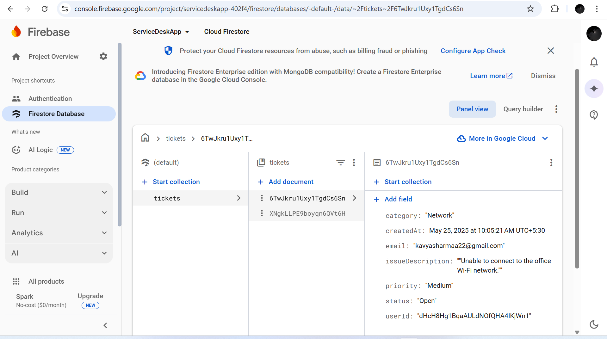
  <br>  </br>
  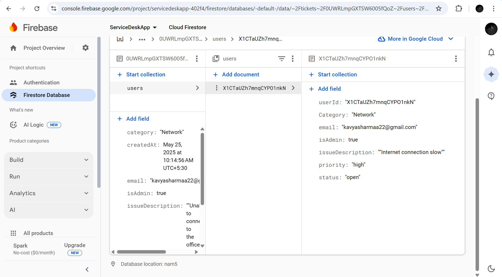


### 2. Razorpay Setup (Optional/Future)

- Create a Razorpay account and obtain API keys from the [Razorpay Dashboard](https://dashboard.razorpay.com/).  
- Follow Razorpay's [Web Integration Documentation](https://razorpay.com/docs/#home-payments) to integrate payments.

### 3. Configure Firebase in Your App

- Add Firebase SDK to your project (see [Firebase Web Setup](https://firebase.google.com/docs/web/setup?authuser=0&hl=en)).  
- Initialize Firebase in your JavaScript with your project's config object.

Example:
```js
const firebaseConfig = {
  apiKey: "YOUR_API_KEY",
  authDomain: "YOUR_PROJECT.firebaseapp.com",
  projectId: "YOUR_PROJECT_ID",
  storageBucket: "YOUR_PROJECT.appspot.com",
  messagingSenderId: "YOUR_SENDER_ID",
  appId: "YOUR_APP_ID"
};
firebase.initializeApp(firebaseConfig);
```

### 4. Running the Application

- Open the main HTML file (e.g., `index.html`) in your preferred browser.  
- Register a new user or login with existing credentials.
    ### Service-Desk App UI
   
  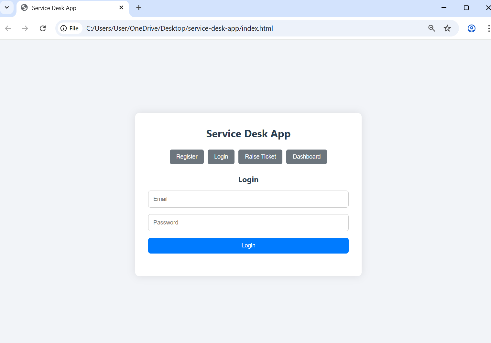
   <br>  </br>
   
    ###  🔐 Register Using New Credentials
   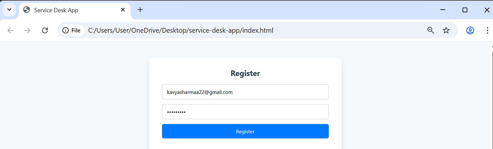
   <br>  </br>

   ### 🔑 Login,✅ Login Successful
   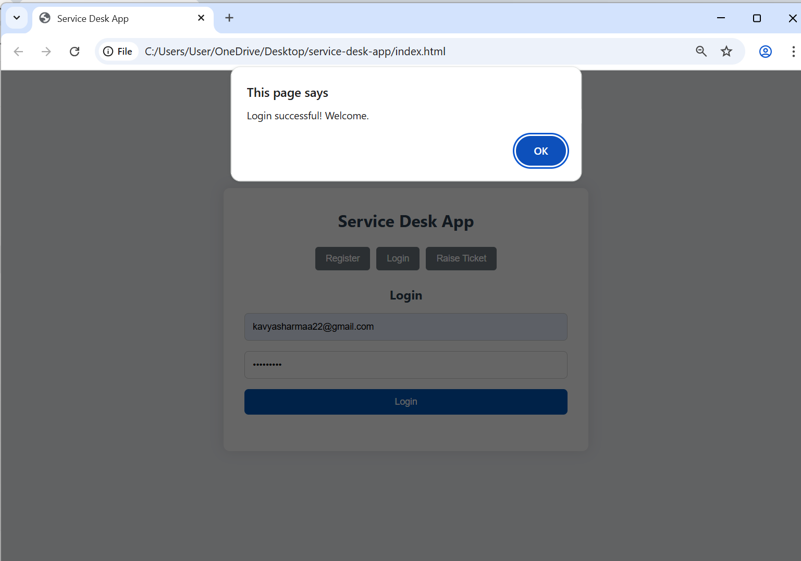
   <br>  </br>

 - Use the interface to raise tickets and track their status.

    ### 📝 Now, Raise a Ticket
   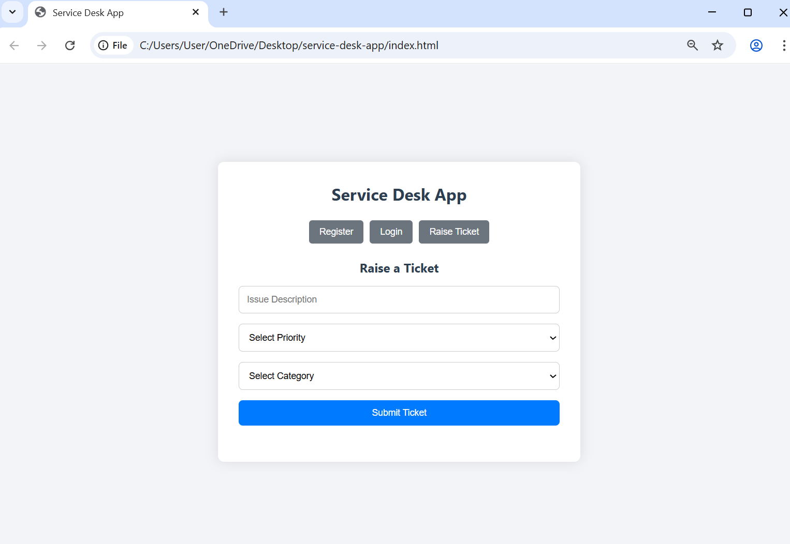
   <br>  </br>
   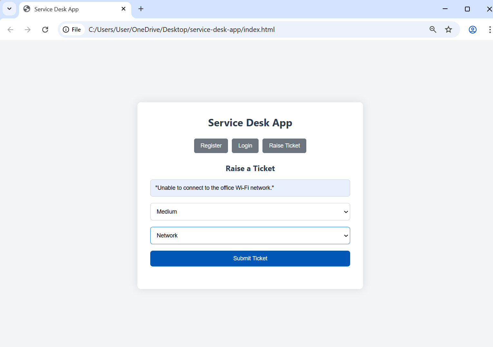
   <br>  </br>

   ### 🎟️ Ticket Raised Successfully
   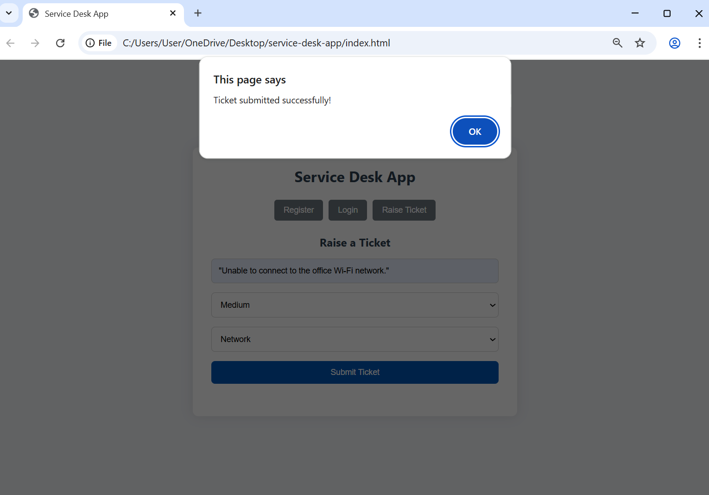
   <br>  </br>

   ### 📊 Dashboard
   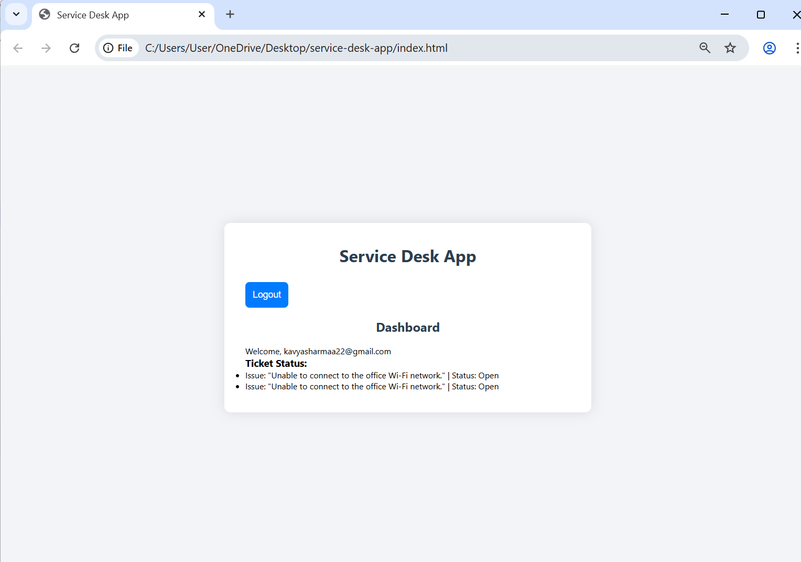
   <br>  </br>
   
   ### Logout Successful.
   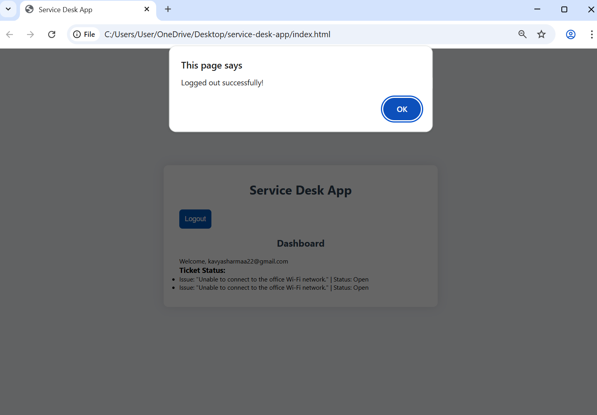
   <br>  </br>

   ### 🔄 Realtime Updates & Ticket Status
   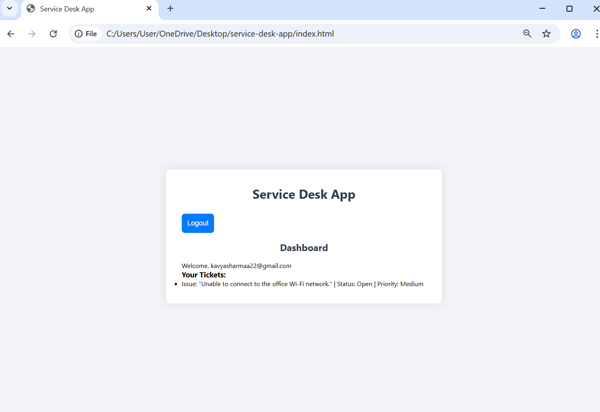
   <br>  </br>

  
- Admin users can manage all tickets through the Admin Panel.

---

## Usage

1. **Register and Login:**  
   Create an account or log in with existing credentials to access the platform.

2. **Raise Tickets:**  
   Fill in the issue description, select priority and category, and submit your ticket.

3. **Track Tickets:**  
   Users can view the status of their submitted tickets in the dashboard.

4. **Admin Management:**  
   Admins can view all tickets, assign, update status, and resolve tickets.

5. **Additional Features:**  
   Future updates will include ticket commenting, real-time updates, and payment processing.

---

## Project Structure

- `index.html` — Main frontend HTML file with embedded sections/forms.  
- `style.css` — CSS styles for UI/UX and responsiveness.  
- `script.js` — JavaScript handling Firebase auth, Firestore interactions, and UI logic.  
- Firebase configuration and SDK scripts included in HTML.

---

## Future Enhancements

- Real-time ticket updates using Firestore listeners.  
- User comments and replies on tickets.  
- Integration of Razorpay for premium support payments.  
- Push notifications for ticket status changes.  
- Enhanced role management with finer permissions.

---

## References

- [Firebase Web Setup Documentation](https://firebase.google.com/docs/web/setup?authuser=0&hl=en)  
- [Firebase Authentication Guide](https://firebase.google.com/docs/auth/web/start)  
- [Firestore Database Guide](https://firebase.google.com/docs/firestore)  
- [Razorpay Payment Gateway Documentation](https://razorpay.com/docs/#home-payments)

---

## License

This project is licensed under the MIT License.

---

## Author

Kavya Sharma
<br></br>
Email: kavyasharmaa2205@gmail.com 
<br></br>
GitHub: kavya-sharma22 

