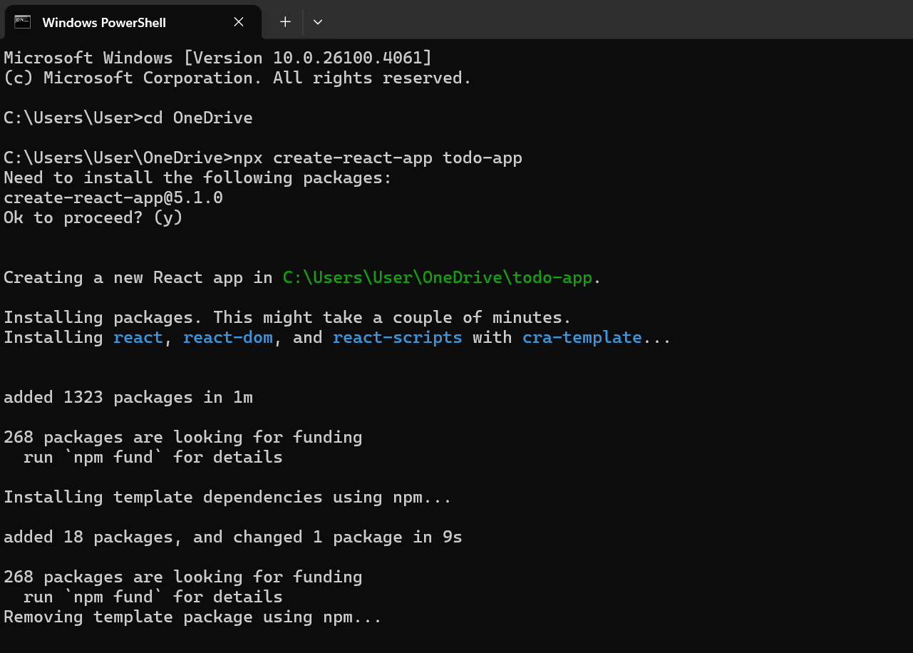
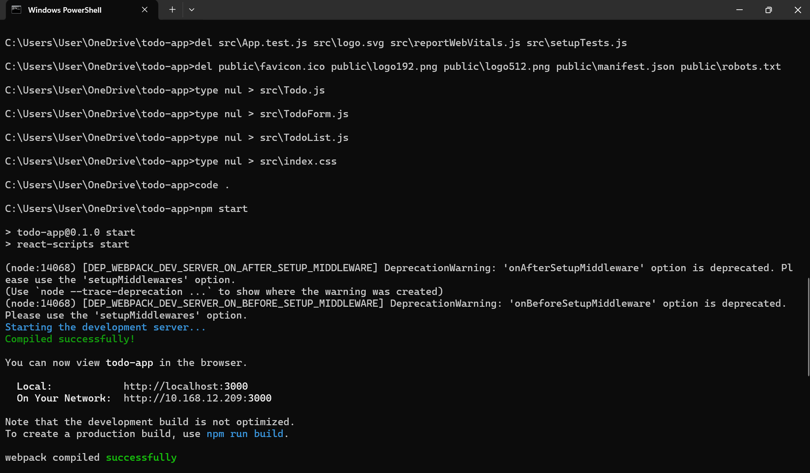
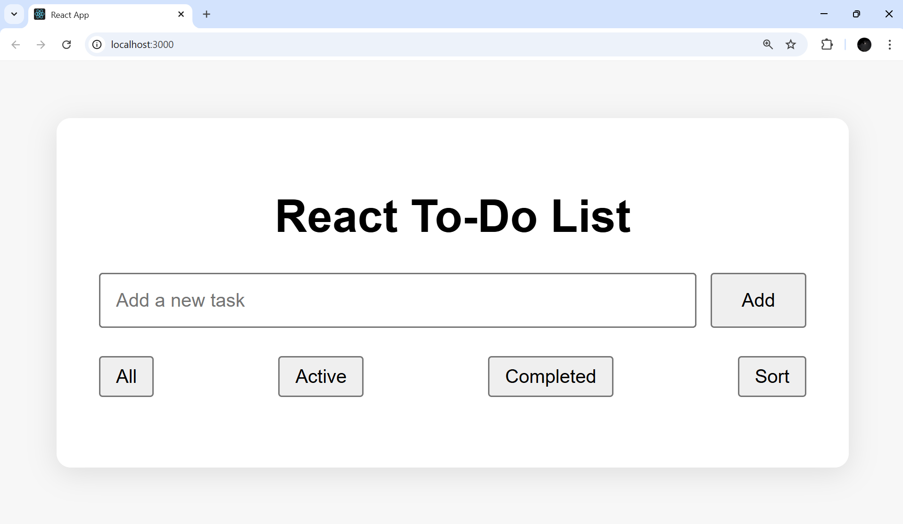
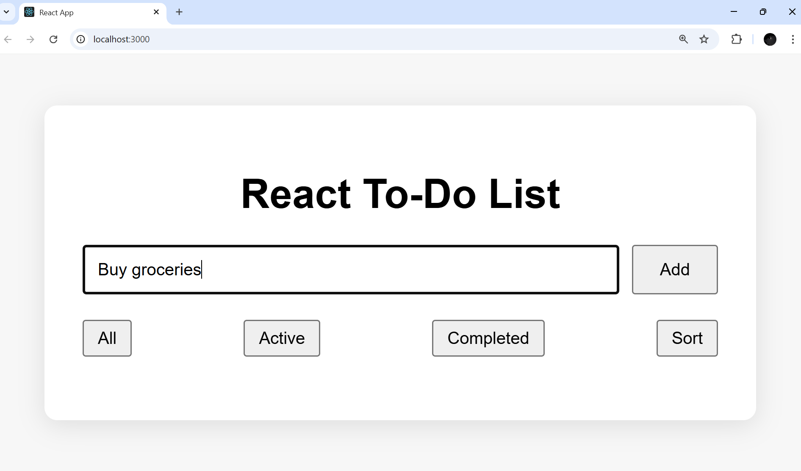
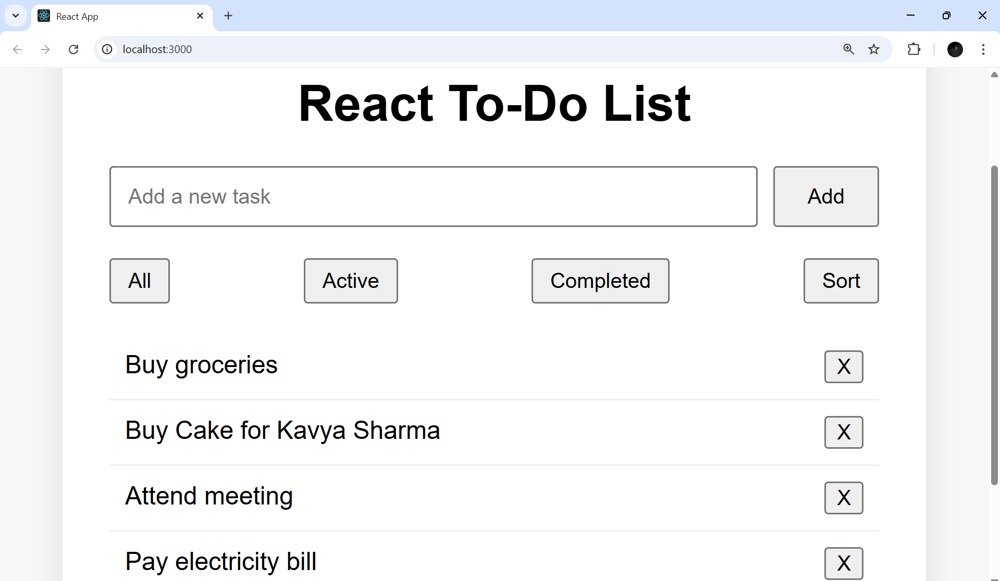
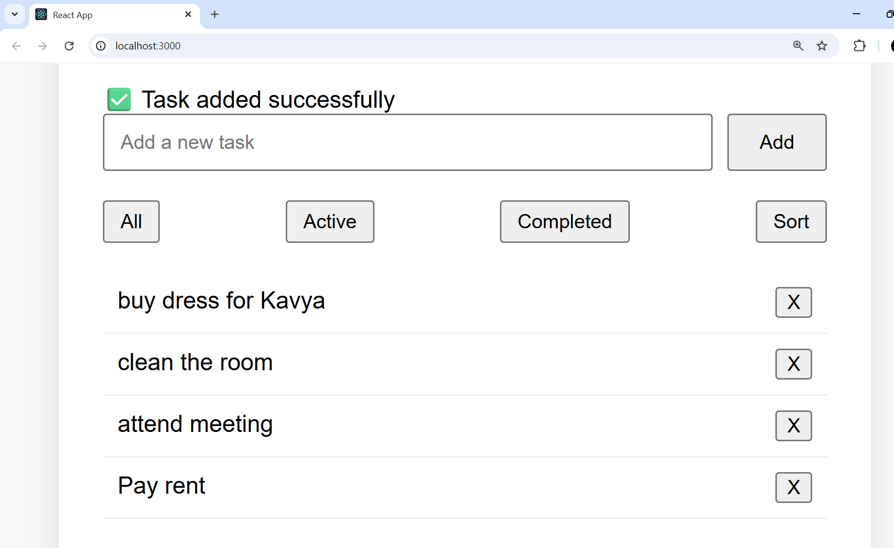
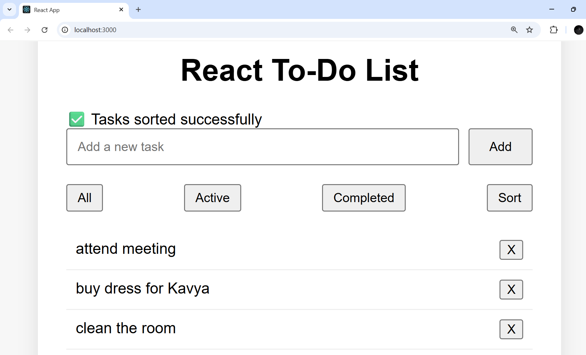
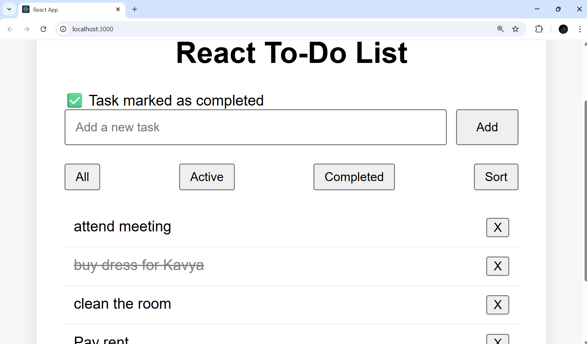
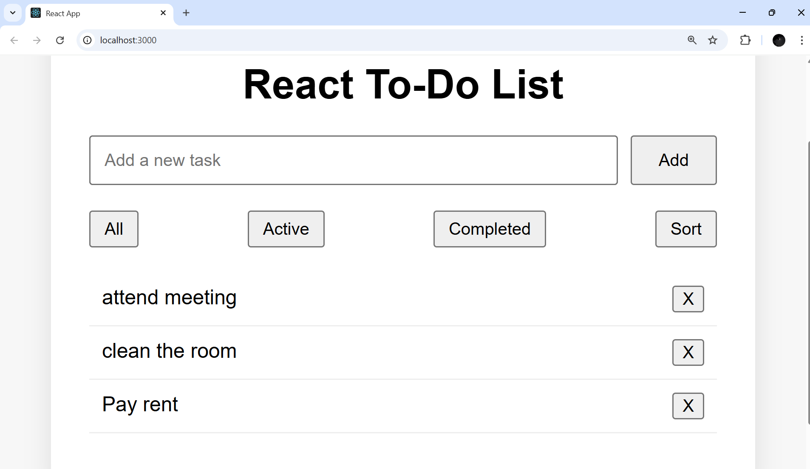
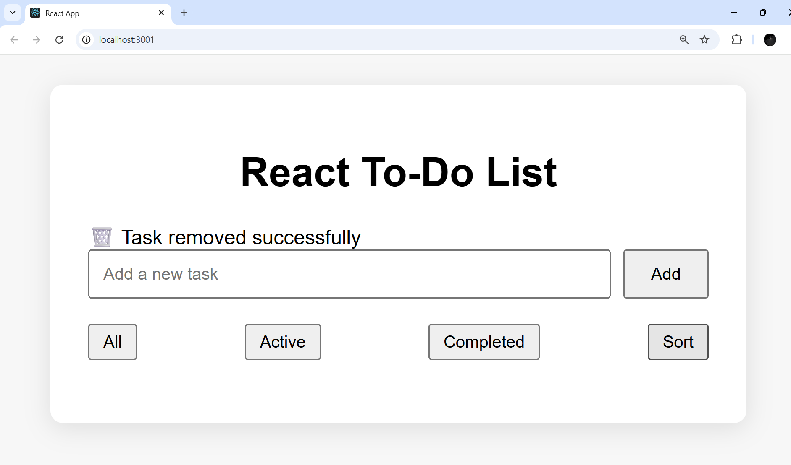

# ✅ React To-Do List App

Develop a **React To-Do List** component allowing task addition, removal, and completion marking. Validate task input, display tasks dynamically, and offer optional sorting, filtering, and localStorage integration.

---

### Folder Initialization 


### Folder Structure


### React To-Do-List UI



### Add Task



### To-Do-List



### Task Added Successfully



### Task Sorted Successfully



### Task Completed Successfully



### Active Tasks



### Tasks Removed Succesfully




---

## 🚀 Features

- 📌 Add new tasks with input validation
- ✅ Mark tasks as completed
- ❌ Delete tasks
- 🔄 Filter tasks: All, Active, Completed
- 🔤 Sort tasks alphabetically
- 💾 Tasks persist using browser `localStorage`
- 📱 Responsive UI for mobile and desktop
- 📢 Real-time success messages for every action

---

## 🛠️ Installation

```bash
# Clone the repository
git clone https://github.com/kavya-sharma22/react-todo-app.git

# Navigate into the project directory
cd react-todo-app

# Install dependencies
npm install

# Start the development server
npm start
```

---

## 🧪 Manual Testing Guide

| Feature            | How to Test                                                     |
|--------------------|------------------------------------------------------------------|
| ➕ Add Task         | Type a task and click **Add**. Success message appears.         |
| ✅ Complete Task    | Click **Complete** on any task. Text is struck through.         |
| ❌ Delete Task      | Click **Delete** on a task. Task disappears with message.        |
| 🔤 Sort Tasks       | Click **Sort** to sort tasks A–Z. Message: "Task sorted".        |
| 🔍 Filter Tasks     | Use **All / Active / Completed** buttons to filter.              |
| 🔁 LocalStorage     | Refresh the page — all tasks persist.                          |
| 📱 Mobile View      | Open in mobile view or resize browser — layout adjusts.        |

---

## 📁 Folder Structure

```
react-todo-app/
├── public/
│   └── index.html
├── src/
│   ├── App.js
│   ├── App.css
│   ├── TodoForm.js
│   ├── TodoList.js
│   └── index.js
├── screenshots/
│   ├── 1.png
│   └── 2.png.......etc
└── README.md
```

---

## 🧰 Technologies Used

- [React](https://reactjs.org/)
- HTML + CSS
- JavaScript (ES6+)
- Browser `localStorage`

---

## ✍️ Author

Developed by Kavya Sharma

---


